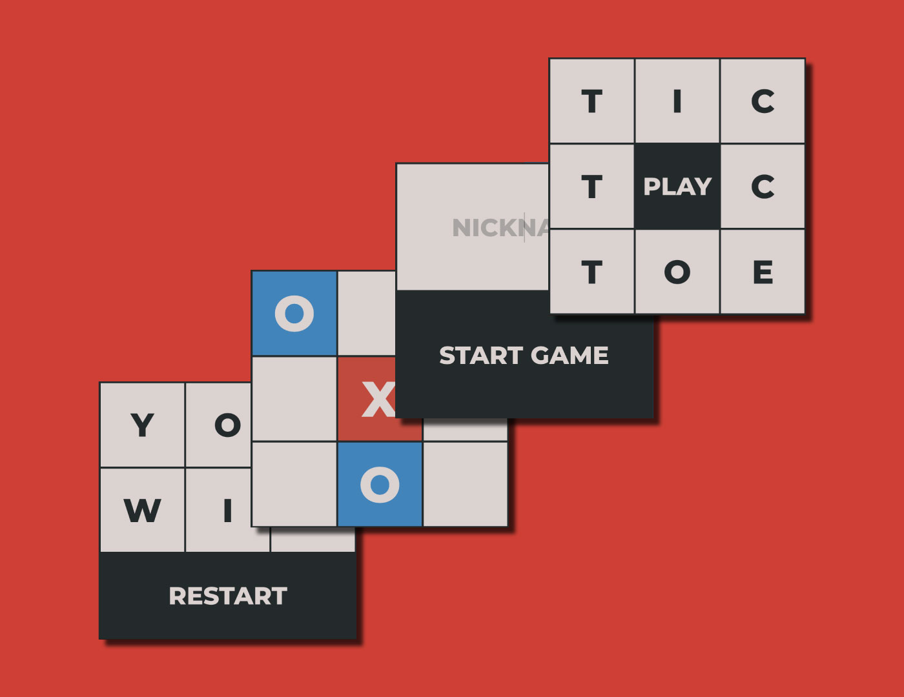

# Tic Tac Toe #

Game developed for the Odin Project Javascript curriculum
[Live Demo](https://blu3tan.github.io/Tic-Tac-Toe/)

------------------------------------------------------------

# Concept #

Started this project with very little inspiration, instead it turned out to be
a very engaging and fun experience both from the coding and visual aspect.

Being this a very simple game i saw no point on developing a pvp version.
The first player to move is randomly chosen between bot and player.
The ai is very basic, the bot just select a random empty spot on the board

The game is fully mobile responsive and tested on chrome and safari.

# Modular game logic #

The focus of this exercise was to develop the code hiding as much as possible
from the global scope using factories and IIFEs
I have splitted the logic on 2 different scripts, one for the board with the
rendering functions and the main board array containing the game state, another
for the game flow, with the ui interaction and the game stages.

The third script contains the only exposed object **GameApp** with the methods
revealed from the other modules added as properties

# Visual and ux #

I wanted to mimic a real game app experience using only vanilla JS and CSS
The end result is a very clean and minimal ui and a smooth ux.
The layout adopted to achieve this is actually a little complex (nothing outrageous tho)

Basically the whole game is made by 4 boards, each one containing one stage of the app:
**Start screen** - **Name input** - **Playable board** - **End screen**

